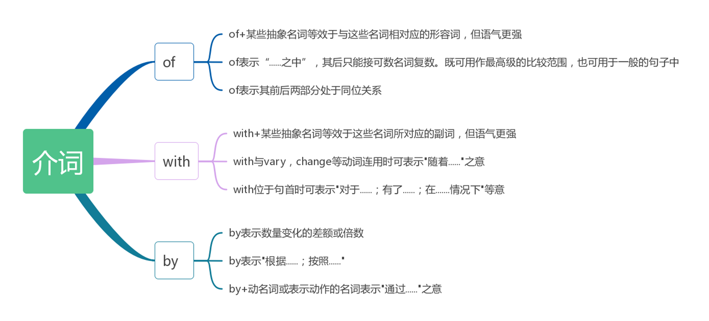

<!-- title:知识总结 -->

- [1. 牛晨 胡鹏展](#1-牛晨-胡鹏展)
  - [1.1. 重点词汇](#11-重点词汇)
  - [1.2. 含有宾语或宾语从句的陈述句型](#12-含有宾语或宾语从句的陈述句型)
  - [1.3. 带有表语或表语从句的陈述句型](#13-带有表语或表语从句的陈述句型)
  - [1.4. 常见的词性转换](#14-常见的词性转换)
    - [1.4.1. 名词转换为形容词](#141-名词转换为形容词)
    - [1.4.2. 名词转换为动词](#142-名词转换为动词)
    - [1.4.3. 形容词转换为名词](#143-形容词转换为名词)
    - [1.4.4. 形容词转化为动词](#144-形容词转化为动词)
    - [1.4.5. 副词转化为名词](#145-副词转化为名词)
    - [1.4.6. 动词转化为名词](#146-动词转化为名词)
  - [1.5. 汉译英](#15-汉译英)
    - [1.5.1. 冠词](#151-冠词)
    - [1.5.2. 数词](#152-数词)
    - [1.5.3. 代词](#153-代词)
    - [1.5.4. 名词](#154-名词)
    - [1.5.5. 动词](#155-动词)
    - [1.5.6. 形容词](#156-形容词)
  - [1.6. 英译汉](#16-英译汉)
    - [1.6.1. 并列句中的省略](#161-并列句中的省略)
    - [1.6.2. 状语从句中的省略](#162-状语从句中的省略)
    - [1.6.3. 准确翻译](#163-准确翻译)
    - [1.6.4. “直译”与“意译”的关系](#164-直译与意译的关系)
    - [1.6.5. 增译](#165-增译)
    - [1.6.6. 省译](#166-省译)
    - [1.6.7. 转译](#167-转译)
- [2. 蔡磊 词的翻译：副词和介词](#2-蔡磊-词的翻译副词和介词)
  - [2.1. 介词 of with by](#21-介词-of-with-by)
    - [2.1.1. Of](#211-of)
    - [2.1.2. With](#212-with)
    - [2.1.3. By](#213-by)
- [3. 唐嘉奕 副词的翻译](#3-唐嘉奕-副词的翻译)
  - [3.1. 副词](#31-副词)
    - [3.1.1. 副词作状语时位于句首](#311-副词作状语时位于句首)
    - [3.1.2. 副词通常位于介词与动词之间 - 不及物动词与介词连用时](#312-副词通常位于介词与动词之间---不及物动词与介词连用时)
    - [3.1.3. 副词通常位于形容词和介词之间 - 在“形容词+介词”的结构中](#313-副词通常位于形容词和介词之间---在形容词介词的结构中)
    - [3.1.4. 被动语态的句子中副词的位置](#314-被动语态的句子中副词的位置)
- [4. 杨派 汉译英之形容词](#4-杨派-汉译英之形容词)
  - [4.1. 01 形容词做后置定语](#41-01-形容词做后置定语)
  - [4.2. 02 形容词做状语](#42-02-形容词做状语)
  - [4.3. 03 形容词短语做后置定语](#43-03-形容词短语做后置定语)
  - [4.4. 04 形容词短语做状语](#44-04-形容词短语做状语)

# 1. 牛晨 胡鹏展
## 1.1. 重点词汇
- 原子  atom
- 质子  proton
- 中子  neutron
- 电子  electron
- 电压  voltage
- 电流  electric current
- 电阻  resistance
- 压缩  compress
- 超出 transcend
- 辐射的 radiant
- 腐蚀  corrosion
- 波  wave
- 电解质 electrolyte
- 可溶的  soluble
- 物质  substance
- 卫星  satellite
- 加速度  acceleration

## 1.2. 含有宾语或宾语从句的陈述句型
- Calculations indicated that...计算表明.....
- Experience has shown that...经验证明.....
- Fig.X illustrates..图X阐明了.....
- Practice has shown that...实践证明......
- Results demonstrate that..结果表明......
- Tests have proved that...试验证明…....
- This implies that ...这意味着....…

## 1.3. 带有表语或表语从句的陈述句型
- Of recent concern is/are ...近来引人重视的......
- Particularly noteworthy is that..特别值得注意的.......
- The case is that ...问题在于.......
- The chances are that..很有可能.....
- The conclusion is that...结论是.…....
- The fact is that...事实是……
- The purpose of this paper is...本文旨在.....
- The question is that...问题就在......

## 1.4. 常见的词性转换
### 1.4.1. 名词转换为形容词
- information superhighway  信息高速公路
- microwave communication channels微波通讯频道

### 1.4.2. 名词转换为动词
- fire 火       to fire  点火
- heat 热量  to heat  加热
- surface 表面   to surface 上浮到表面

### 1.4.3. 形容词转换为名词

英语的形容词大多只要在其前加上定冠词，就可以使之名词化，表示相应的人或事物;另外有许多形容词已经彻底名词化了:

- the upper and the lower 上部和下部
- the heaviest of the alloys 合金中最重的一种chemical 化学药品/物质
- numeral 数字
- periodical 期刊
- professional 专业人员

### 1.4.4. 形容词转化为动词
- cool 凉爽的  to cool 冷却
- clear 清楚的  to clear 清除消除
- dry 干燥的  to dry 干燥，烘干

### 1.4.5. 副词转化为名词
- ups and downs 沉浮、盛衰
- Today is Sunday.今天是星期日。(表示时间、地点的副词常可转化为名词)

### 1.4.6. 动词转化为名词
由动词转化而来的名词，大多表示原来的动作、状态，有时也可引申表示相关的人或器物的名称。例如:

- to run 跑运转                 run 运行;行程
- to exhibit 展览，展示    exhibit 展品
- to control 控制       control 控制，控制器
- to combine 联合    combine 联合收割机
- to contrast 对比     contrast 对比度
- to produce 生产     produce 农副产品

## 1.5. 汉译英

### 1.5.1. 冠词
> 在普通的单数可数名词前一定要用冠词，泛指时多用不定冠词。

如果把电压加到电路的两端，就会发现电流在电路中流动。
（电压 voltage    加到、应用于 be applied across   电流 electric current     流动 flow）

译句：lf a voltage is applied across a circuit, an electric current will be found to flow in the circuit.

> 前面已提到过的或同一句中第二次提到的或心中特指的事物，以及带有后置修饰语的名词,其前应该使用定冠词。

物理这门科学在当今世界非常有用。

译句：The science of physics is very useful in the modern world.

### 1.5.2. 数词
> A的大小（长度，质量....）是B的N倍,或A比B大(长，重......) N-1倍。若将汉语的“A比B大或长，重.…倍”译成英语时要加一倍。“增加到N倍”或“增加了N-1倍(净增加的部分)Y"的译法。在将汉语表示“净增加”的倍数译成英语时，要在汉语的倍数上再加一倍。

钢产量比2004年增长了三倍。

译句：The output of steel has been increased four times as against 2004.

这台机器改善了劳动条件,并使工效提高了三倍。（工效efficiency）

译句：The machine improves the working conditions and raises efficiency four times.

### 1.5.3. 代词
> 用it, its, they ,their等代词来代替后面主句中的人或物

在某处有害废料太多的话,它会对我们周围的东西造成巨大的危害。（有害废料 poisonous waste）

译句：Where there is too much of it, the poisonous waste may do great harm to the things around us.(it指代the poisonous waste )

### 1.5.4. 名词
> 名词在句中主要作主语、宾语、表语介词宾语、定语、同位语等。

**1. 名词与介词的一种搭配模式为:名词of+A+介词+B,这里A和B均为名词。**

硅原子中缺少—个电子，可以看成是一个空穴。
(硅原子 silicon atom  缺少absence  空穴 hole  电子  electron)

译句：The absence of an electron from a silicon atom can be thought of as a hole.

**2. 名词短语代替表示条件、原因、目的、时间等的状语从句。**

加上反馈后，输出变稳定了。（加上addition  反馈feedback ）

译句：The addition of the feedback makes the output stable.(名词短语“The addition of the feedback"代替了时间状语从句“After the feedback isadded”。)

### 1.5.5. 动词
> 特殊连系动词指的是少数实义动词(主要是不及物动词)，当其后跟形容词时变成连系动词，常见的有remain, go.get, turn, stay, appear, look, prove等。

本周气温一直都很高。（stay）

译句：The temperature has stayed hot this week.

> 半助动词是指在功能上介乎主动词和助动词之间的一种结构。半助动词remain, seem, appear, happen等与动词不定式构成谓语。

这些问题对人类的影响有待于研究。（remain）

译句：The effects of these problems on human beings remain to be studied.

### 1.5.6. 形容词
> 一些形容词置于被修饰的名词后以加强语气，大多是以后缀-able或-ible结尾的形容词如: available ,obtainable（可获得的）, receivable(可收款的), achievable（可达到的）, responsible（负责的）, possible等。另外还有corresponding（符合的）, similar, total等。

所能获得的检验结果与我们期望的一致。（获得的 obtainable）

译句：The testing result obtainable is in agreement with what we have expected.

> 当形容词修饰由some, every, any, no与-thing,-one,-body组成的复合代词时必须后置。

细胞质的外形方面没有什么特殊的地方。（特殊的 extraordinary  细胞质protoplasm）

译句：There is nothing extraordinary in the appearance of protoplasm.

## 1.6. 英译汉
### 1.6.1. 并列句中的省略

> 在并列句中,在接续的分句里出现的相同句法成分，如主语、谓语(包括“是”动词、行为动词和被动语态助动词)、宾语、表语乃至状语等，有时甚至还包括连词，为避免重复皆可予以省略。

The signals are grouped into packages and a number of packages (are) combined into a composite signal.

翻译：所有信号分成许多词组，而若干组信号又组合成一个复合信号。(第二个分句中被动语态助动词省去)

The speed against the wind is 20 miles per hour and ( the speed ) with the wind ( is ) 80miles per hour.

翻译：顶风时速度为每小时20英里，顺风时速为每小时80英里。(第二个分句中与第一个分句相同的主语、谓语动词以及状语省去，翻译时常需补译出来)

### 1.6.2. 状语从句中的省略
> 状语从句中的省略现象是最为常见的。当状语从句的主语和主句的主语所指相同时，从句的主语和相应的被动语态助动词往往予以省略，有时甚至将从属连词以及相同的谓语动词也一并省去。

T will represent temperature alone in this book unless (it is)otherwise stated.

翻译：在本书T将只表示温度，除非另有说明。(条件状语从句中与主句主语所指相同的代词主语及其被动语态助动词省去)

Most elements as(they are) found in nature are mixtures of isotopes.

翻译：自然界中发现的元素大部分是同位素的混合物。（起定语作用的方式状语从句中与主句所指相同的主语及被动语态助动词省去;翻译时仍转换还原为定语）

### 1.6.3. 准确翻译
> 众所周知，科学技术对于准确性的要求是特别严格的，大到理论的阐述，小到数据的举证，都不能有丝毫的谬误和误差。这在客观上就要求科技翻译也必须做到准确无误。

There are always crossed transverse steady and longitudinal alternating fields.

译文A∶始终存在着交叉横向稳定和纵向交变磁场。

译文B∶始终存在着交叉的横向稳定磁场和纵向交变磁场。

>分析∶译文A的句意不够明确，易于让人把“交叉”一词同另外两个修饰语“横向”和“稳定”视为并列关系，而且还与另一组修饰语“纵向交变”并列，共同修饰“磁场”一词;此外，只译一个“磁场”容易让人误以为是具两种特征，既“交叉横向稳定”，又“纵向交变"的一个磁场。译文B的语义明确多了，汉语并不总忌讳必要的重复，增补一个“磁场”与原文复数名词“fields"对等;添加一个“的”字清楚地表明“交叉”修饰两个磁场，即两个磁场是相互交叉的。

### 1.6.4. “直译”与“意译”的关系
> 所谓直译(Literal Translation),是指在符合目的语语言规范的前提下，在译文中既保持原文的内容，又尽可能保持原文的形式的翻译处理式。需要注意的是，直译绝不是死译或硬译。

But I hated Sakamoto, and l had a feeling he'd surely lead us both to our ancestors.

但是我恨坂本，并预感到他肯定会领着咱们俩去见祖宗。(此句基本按照原句表层结构直译，其中to our ancestors如果意译成“去送死”虽也可正确表达原文内容，译文也极其通顺，却会损失原文的形式和风格，因而会逊色不少。)

Nothing could be done.

人们/我们无能为力。(此句若译成“无事可以被做”，那就是死译)

> 所谓意译(Liberal Translation)，则是指侧重于忠实地传达原文语义特别是隐含的信息而不拘泥于原文形式的翻译处理方式。

Do you see any green in my eye?

你以为我是好欺骗的吗?(如按字面译为“你在我的眼睛里看见绿了吗?"则是死译，虽保持了原文形式，却会令人不知所云。“绿”在英语中常隐喻为“幼稚”、“初出茅庐”之意，故而经常转义为“易受愚弄”)

The officer asked him not to let the cat out of the bag.

该官员要求他不要泄露天机。(此句若译成...不要让猫从包里跑出去或......对那只猫严加看管防止其逃跑，那就是典型的胡译或乱译)

### 1.6.5. 增译
> 科技书刊中的许多内容都是对事物和现象的论证和探讨等，因而常常涉及到各种条件，所以，在许多场合下有必要用虚拟语气。动词的虚拟语气译成汉语时，有时需要增加一些副词来表达出虚拟语气的真实含义。例如︰

ln fact , these first rubber overshoes and raincoats might have been made of wax ,only they were a bit stronger .

译文∶事实上，最初的胶鞋和雨衣几乎就象蜡做的一样，只不过比蜡做得结实一点罢了。

> 此句中的“might have been made of”引出了虚拟语气，翻译成汉语时，如果不增加副词来表达虚拟语气的真实含义，就容易使人产生或至少不排除“可能真是蜡做成”这种错觉，而不能正确地表达出该句中真正的虚拟语气。所以，在科技英语的翻译时遇到这种情况应适当地增加副词。译文中的“就象”二字表达出了此句的虚拟语气。

### 1.6.6. 省译
> 省译是删去有些可有可无的，或者有了反嫌累赘或者违背译文习惯的词，如冠词在英文中广泛使用，但汉语根本没有冠词，英语中的介词、连词和代词在翻译时可借助汉语语序表达的逻辑关系而省略。同时，英语中不可缺少的一些名词和动词等在汉译时有时也可省略。

This laser beam covers a very narrow range of frequencies 

译文∶该激光束的频率范围很窄。(动词“cover"在译文中省略了)

Different kinds of matter have different properties .

译文∶不同物质具有不同的性质。(译文中省略了“kinds")

### 1.6.7. 转译
> 英语含被动语态的句式转换为汉语主动句式时，原文中的主语在译文中有时仍可作主语，有时也可作宾语﹔有时可根据上下文增补合适的主语，全句还可译成无主语句或是“是...的”结构或是“把..”等结构。

Submarines exercise frequently,both surfaced and dived,in the area indicated. A good look-out isto be kept for them when passing through these waters.

潜水艇经常在图中标识的水域进行水面和水下演习。船舶经过这些水域时要保持良好的隙望。

> 译文中句子“Agood look-out is to be kept for them when passing through these waters.”中的被动语态在翻译成汉语时转换成了主动语态，这时原句的主语“良好的隙望”转换成了汉语句子的宾语，而根据汉语表达习惯的需要，增补了适当的主语“船舶”，因而被译成“船舶经过这些水域时要保持良好的隙望。”

# 2. 蔡磊 词的翻译：副词和介词
## 2.1. 介词 of with by

### 2.1.1. Of

**1. of+某些抽象名词等效于与这些名词相对应的形容词，但语气更强。此时，”of“的意思为”具......”。**

这些资料对我们的实验特别有价值。

These data are of particular value to us in our experiment.

学生们的实践活动是至关重要的。

What the students do in their practice is of great importance.

**2. of表示“......之中”，其后只能接可数名词复数。既可用作最高级的比较范围，也可用于一般的句子中。**

在这三种情况中，仅仅最后这种是可接受的。

Of these three circumstances, only the last is acceptable.

在飞船所载的11件仪器中，有2件来自美国，4件来自欧洲。

Of the eleven instruments carried by the spaceship, two were from U.S. , and four from Europe.

**3. of表示其前后两部分处于同位关系。**

翘曲机翼的概念由此诞生

Thus, the concept of wing warping was born.

水的比喻可以帮助解释电的概念

The analogy of water can help explain the concept of electricity.

### 2.1.2. With
**1. with+某些抽象名词等效于与这些名词所对应 的副词，但语气更强。**

科学仪器的制造必须非常精密

Scientific instruments have to be made with great precision

病员的数量正以惊人的速度增加

The number of the sick was increasing with appalling rapidity

**2. with与vary,change,increase,decrease等动词连用时可表示“随着......”之意。**

随着对地下水资源需求的增多，地下水水权冲突现象愈演愈烈

The conflicts of the right to groundwater are becoming increasingly intense with the increase of its demand.

冷血动物的体温随着周围环境温度的变化而变化

The temperature of cold-blood animals changes with the temperature of the surroundings.

**3. with位于句首时可表示“对于......;有了......;在......情况下”等意。**

在作用力不变的情况下，加速度和质量成反比

With a constant force, the acceleration is inversely proportional to the mass.

有了互联网，两个或几个相距较远的人可以轻易地一同写同一报告

With the Internet, it is easy for two or more people far apart to write a report together.

### 2.1.3. By
**1. by表示数量变化的差额或倍数。**

1983年以来，电视机的产量增加了三倍。

The production of TV sets has been increased by a factor of 4 since 1983.

在交流电路中，若电压，电流相位正好相差90°，则电路上消耗的功率为零。

In Ac circuits, the power consumed in a circuit will be zero if the voltages and currents differ in phase by 90°.

**2. by表示“根据......；按照......”。**

根据有关理论，科学家们有了下面的推测

By the relevant theories, scientists made a speculation below.

根据欧姆定律，我们可以知道电流，电压和电阻之间存在的关系

By Ohm’s law, we can know the relation between current, voltage and resistance.

**3. by+动名词或表示动作的名词，表示”通过......“之意。**
通过该系统的应用，实现了生产过程的自动化和标准化

By the application of this system, the process of production becomes automatic and standardized.

采用数字信号技术已将火星图片成功传输到地球

The pictures of the Mars have been transmitted successfully to the earth by using digital techniques.

# 3. 唐嘉奕 副词的翻译
## 3.1. 副词
副词在句中主要作修饰成分,用于修饰动词形容间、副词及其他结构以表示程度、方式、时间、地点以及表示说话人对话语的态度等。

- 副词作状语位于句首
- 位于介词与动词之间
- 位于形容词和介词之间
- 在被动语态中的位置

### 3.1.1. 副词作状语时位于句首
通常这些参数中有一些是已知的。（parameter）

Usually some of these parameters are known.

这样就建立了系统的框架。（systematic framework）

Thus, a systematic framework is established.

显然，灯泡里的灯丝断了。（filament灯丝、bulb 灯泡）

Clearly, the filament in the bulb is broken.

### 3.1.2. 副词通常位于介词与动词之间 - 不及物动词与介词连用时

焦炭的主要成分是碳。（coke、carbon）

Coke consists mainly of carbon.

当温度低于临界温度时，电子能自由地通过晶格运动。(critical、electrons、lattice)

At temperatures below the critical temperature, the electrons move freely throughout the lattice.

### 3.1.3. 副词通常位于形容词和介词之间 - 在“形容词+介词”的结构中

“温室效应”主要是由水汽和二氧化碳引起的。

The “greenhouse effect” is due primarily to water vapor and carbon dioxide.

近年来人们对于纸张的日益增长的需求主要是由于人们越来越多地使用因特网。

The growing demand for paper in recent years is due largely to the increased use of the Internet.

### 3.1.4. 被动语态的句子中副词的位置
1. 位于过去分词之前 - 在没有情态动词或助动词“will”等时

病菌很容易从一个人传给另一个人。

Germs are easily passed from person to person.

2. 有的副词位于“be”之前，有的则位于“be”之后 - 在有情态动词或“will”等时

这条信息我们经常能在互联网上看到。

The information can usually be found on the Website.

3. 副词位于被动语态的谓语之后

音乐在CD上以数字方式存储。

Music on a CD is stored digitally.

# 4. 杨派 汉译英之形容词

形容词在句子中主要作修饰成分。大多数形容词修饰名词、充当主补和宾补，能受very等程度副词的修饰，并有比较级和最高级形式。

- 形容词做后置定语
- 形容词做状语
- 形容词短语做后置定语
- 形容词短语做状语

## 4.1. 01 形容词做后置定语 

> 必须后置的形容词主要有:present(本，此，盖，现存的); else (其他的，别的)(在疑问代词和不定代词之后);what (so) ever(任何的)(在有no或any修饰的名词后);involved(有关的,涉及的);inclusive(首尾包括在内的)等。例如:

即使低压下也存在着大量分子

Even at low pressure there are still large numbers of molecules present.

原子核中包含的正电荷的总数和存在于该原子核中的质子数相同。

The nucleus contains a total positive charge that is equal to the number of protons present.

所能获得的检验结果与我们期望的一致。

The testing result obtainable is in agreement with what we have expected.

每单位时间内衰变的放射性原子数正比于存在的原子数。

The number of radioactive atoms that decay per unit of time is proportional to the number ofatoms available.

用户数据通常与某一应用有关，例如所能接收到的账目。

User data are usually associated with an application such as accounts receivable.

负责部门将采取具体措施来制止污染。

The department responsible will take concrete measures to stop the pollution.

降雨量能达到总共20英寸。

The rainfall could reach 20 inches total.

> 注:有些以-able或-ible结尾的形容词如invisible , navigable,passable等作修饰语，前置或后置意义略有差别:前置时表示永久特征，后置时表示暂时情况。例如:

金星是清楚可视的星体。

Venus（金星） is a clearly visible star.

它是现在唯一能看到的星体。

lt is the only star visible now.

> 当形容词修饰由some, every, any, no与-thing,-one, -body组成的复合代词时必须后置。例如:

细胞质的外形方面没有什么特殊的地方。

There is nothing extraordinary in the appearance of protoplasm(细胞质).

式(4-3)说明了物体能获得的最大速度方面的一些有关情况。

Equation (4 - 3) has something interesting to say about the greatest speedan object can have.

将来所有的电子设备都得数字化。

Everything electronic will be done digitally.

> “副词(或数量状语)+形容词”可作后置定语。例如:

请给我拿一根10米的导线。

Please fetch me a wire ten meters long.

第14,15章讨论它们的电、磁特性,这些特性往往是极为重要的。

Their electrical and magnetic properties, often paramount（重要的）, are discussed in Chapters 14 and 15.

如果皮带为8英寸宽或更宽的话,则使用本栏中的第二个数字。

For belts 8 inches wide and over, use the second figure of the column.

> 两个形容词作定语的情况:在由and或both... and （既.....又）以及or或either..or（无论...还是...../或是...或是...）连接的两个形容词可作后置定语。例如:

所有大大小小的发动机，都按照这一原理工作。

All the engines, large or small, work on this principle.

电流等于电源电动势除以电路的总电阻，既包括外电阻也包括内电阻。

The current equals the source emf（电动势） divided by the total circuit resistance, external and internal.

这个幂的规则适用于一切有理数，包括正的和负的。

The power rule can be used for all rational exponents（有理数）, positive and negative.

中子既不带正电，也不带负电.

A neutron carries no electronic charge, neither positive nor negative.

## 4.2. 02 形容词做状语

> 单个形容词作状语主要是表示方式，大多是un ~ed形式的形容词。例如:

她在这项研究中的贡献大多没有获得承认。

Her contribution to the research went largely unacknowledged.

信用贷款不断增加而未受限制。

The use of credit continues/ grows unchecked.

大多数α粒子通过箔片时方向并没有改变。

Most of the a- particles went through the foil（箔片） unchanged in direction.

只要瞬时振幅保持小于偏压,就能无失真地传送信号的波形。

The signal waveform is transmitted undistorted so long as the instantaneous amplitude（振幅）  remains smaller than the bias voltages（偏压）.

> 处于句尾时,可以表示附加说明或对前面句子的评述，更多的是作方式状语。例如:

必须仔细考虑效率问题,要使其兼顾系统的其他要求。

The efficiency must be carefully considered, consistent with the other requirements of the system.(形容词短语在此附加说明)

在这种情况下,该球只是以相切于( tangential to )其以前路径的方向向前运动。

In this case the ball simply proceeds tangential（相切） to its former path. (形容词短语作方式状语修饰动词“proceeds")

该导体正平行于磁场运动。

The conductor is moving parallel to the magneticfield.(形容词短语作方式状语修饰“moving")

这项研究还处于早期阶段，大概类似40年前造出第一个半导体逻辑闸时的状况。

The work is at an early stage, roughly analogous to the construction of the first semiconductor logic gate（半导体逻辑闸） some 40 years ago.

## 4.3. 03 形容词短语做后置定语

这种情况的一个例子是平行于地球表面的运动。

An example of this is the motion parallel（平行） to the surface of the earth.

在测量远短于一秒的时间间隔时，就采用十进制。

In the measurement of time intervals much shorter than a second,the decimal system is used.

必须使用精确到百万分之几秒的定时方法。

A method of timing accurate to a few millionths of second is necessary.

## 4.4. 04 形容词短语做状语
> 处于句首时主要表示原因、条件、让步，对主语的附加说明或对全句的评注性状语等。实际上，这种用法可以看成是分词短语中的“being”省去了。例如:

由于爱因斯坦清楚光的电磁理论不能解释光电效应，所以他于1905年寻找到了另外一种方法来理解它。

Aware that the electromagnetic theory of light failed to explain the photoelectric effect（光电效应）,Albert Einstein sought some other way of understanding it in 1905.

与其他所有振荡器转换技术一样，锁相模式也不能用于脉冲式的输人。

Common to all other oscillator transfer techniques（振荡器转换技术）(形容词短语对主语作附加说明)，the phase-locked mode cannot be used for pulsed inputs.

所有的电路不论大小均含有种类相同的一些元件。
Large or small, all the circuits contain the same kinds of components.

如果铁块不受潮，则不易生锈。

Free from the attack of moisture, a piece of iron will not rust veryfast.

